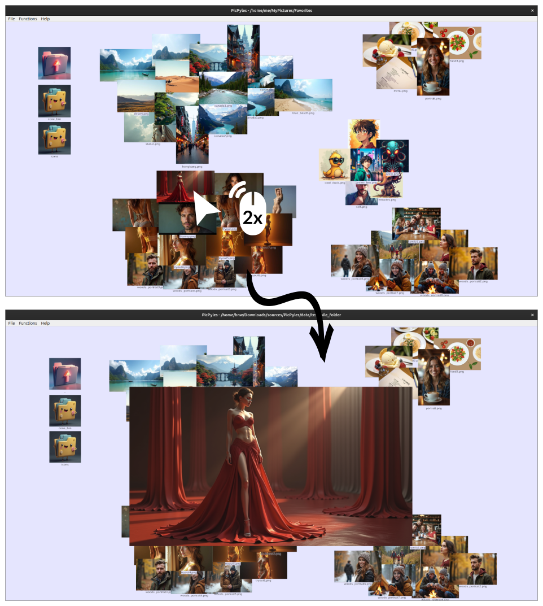

#  PicPyles

PicPyles is a simple, personal tool for organizing your local photo collections. It lets you sort your images into piles, just like spreading photos out on a table. Whether you're grouping memories or curating a slideshow, PicPyles helps you arrange and sequence your pictures in a way that feels natural, all within your own folders—no cloud, no fuss, just your photos, your way.

## Step 1 - organize your pictures into piles

PicPyles will always remember the way you sorted your pictures.

## Step 2 - enlarge a pciture by double-clicking

Close it again by double clicking.

## Step 3 - enjoy the slideshow


Remember: You can recompute the slideshow sequence from the `Functions > Recompute image sequence` menu when you change your piles.

## Step 4 - if you value PicPyles


and I will get back to working on new features!

You don't know how? Find out!
* [strike.me](https://strike.me/) thorugh google or apple pay. [Further reading.](https://strike.me/learn/what-is-a-lightning-invoice/)
* [Do it the interesting way!](https://learn.robosats.com/docs/quick-start/)

## 🛠️ Installation & Setup

PicPyles is available as an executable for Windows and Linux. Head over to the [Releases](https://github.com/reish2/PicPyles/releases) section to download the latest version.

## 📦 Build from Source

To get started with PicPyles development, clone the repository, set up a virtual environment, install dependencies, and run the application:

```bash
git clone https://github.com/reish2/PicPyles.git
cd PicPyles
python -m venv picpyles-env
source picpyles-env/bin/activate  # On Linux/Mac
# or
picpyles-env\Scripts\activate  # On Windows
pip install -r requirements.txt
python main.py
```

### Requirements

* Python 3.9+
* PyQt5
* PyOpenGL
* Pillow
* Numpy

### Build installer

```bash
pip install pyinstaller
pyinstaller PicPyles-build-linux.spec
```

## 💻 Project Structure

The project is organized into the following directories:

- `views/`: GUI-related code.
- `models/`: Data structures and logic.
- `controllers/`: Handles interactions between models and views.
- `assets/`: Icons and fonts.
- `requirements.txt`: Lists dependencies.
- `main.py`: Application entry point.

## 🤝 Contributing

Contributions are welcome! If you'd like to contribute to the project, please fork the repository and submit a pull request.

## 📝 License

See the LICENSE file for details.